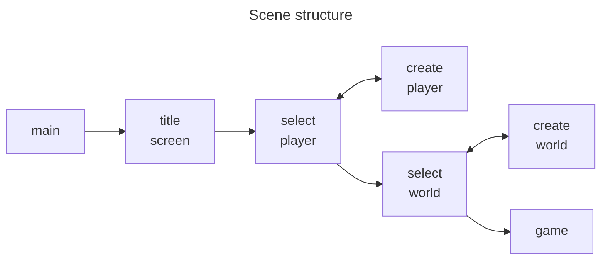

# ✨ Start Screen

[](https://github.com/zenixsgames/godot-start-screen)
[](https://godotengine.org/)
[](https://github.com/zenixsgames/godot-start-screen)

## ⚡ Overview

This project is a simple start screen template, especially designed for sandbox games.
<p align="center">

</p>



## 🛠️ Installation

```bash
gh repo clone zenixsgames/godot-start-screen
```

## 🚀 Getting Started

1. Download and install the Godot Engine. You can find the official version on the [Godot website](https://godotengine.org/).
2. Download this project and unzip the file.
3. Run the Project in Godot.

## 📝 License
This project is under [MIT License](https://github.com/zenixsgames/godot-start-screen/blob/main/LICENSE).
